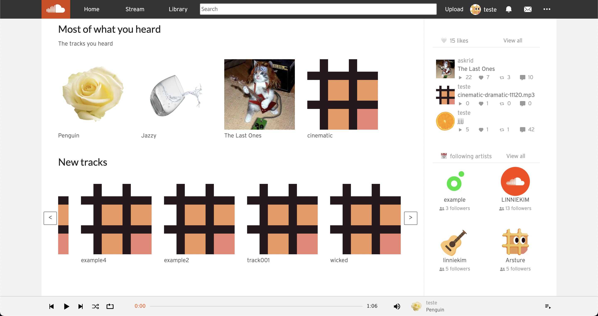
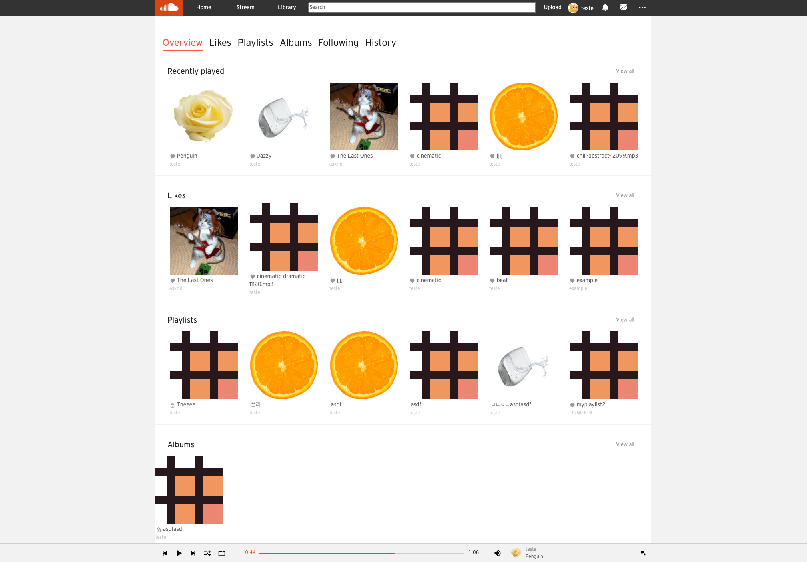
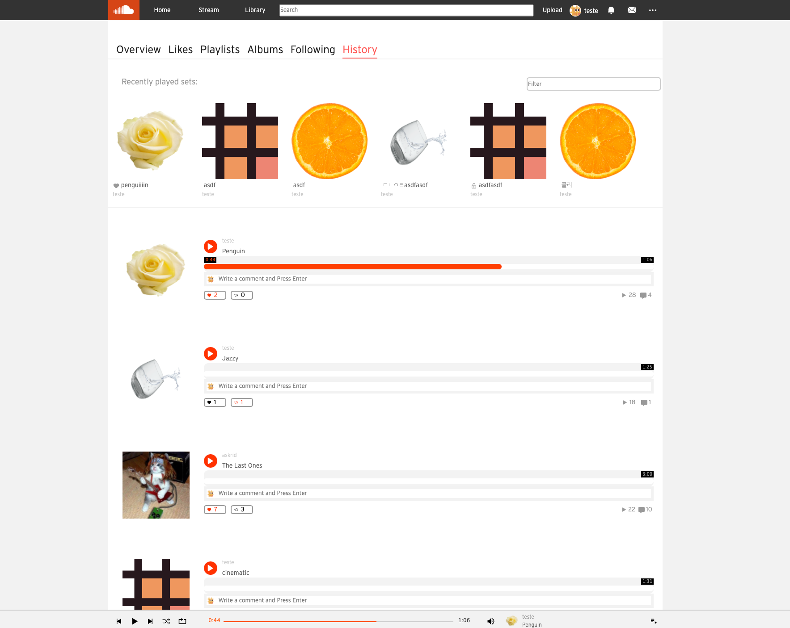
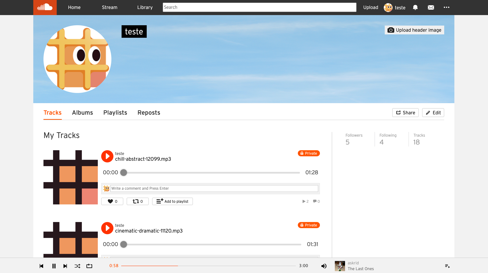
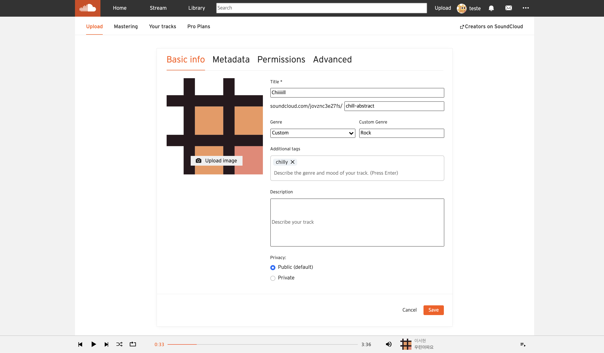
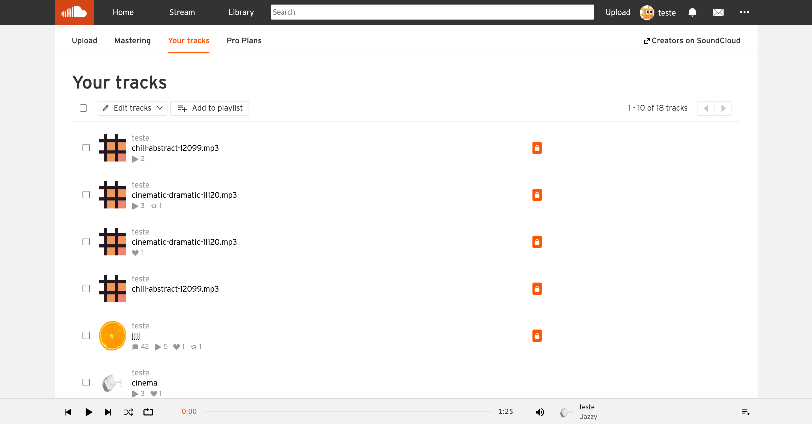
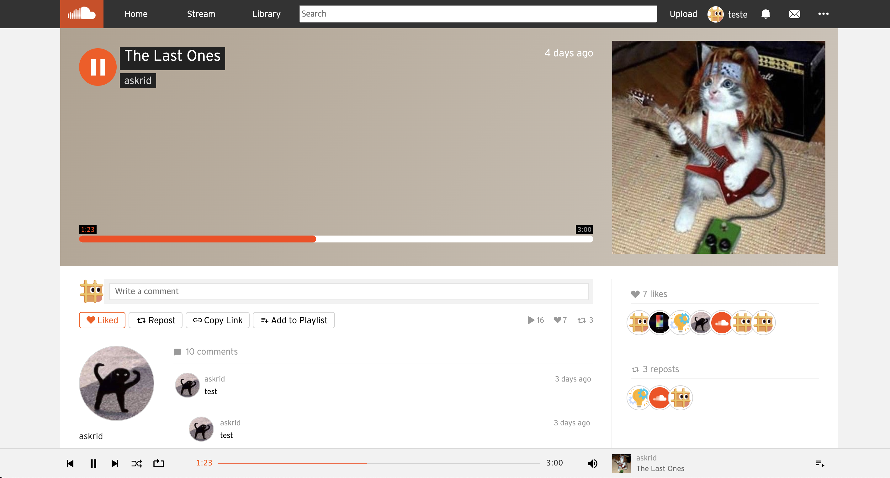
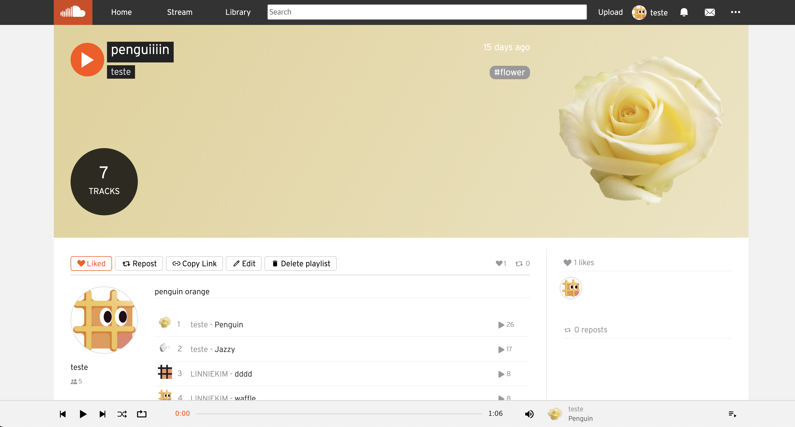
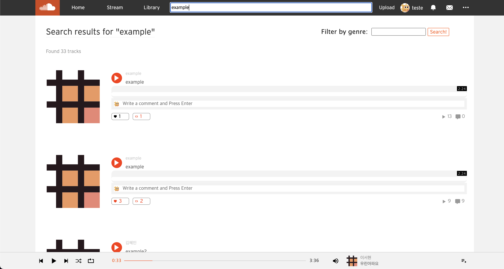

# team10-web

**[SoundWaffle](https://www.soundwaffle.com)** 

- 클론한 서비스: **`SoundCloud`**
- 배포: `AWS S3` + `Cloudfront`
- 라이브러리는 **`React`**, 언어는 `Typescript` 사용

- 주요 기능:
  - 회원가입, 로그인, 로그아웃할 수 있음(12시간동안 자동 로그인)
  - 음악을 감상하고 `like`, `repost` 하거나 아티스트를 `follow`할  수 있음
  - 음악이나 플레이리스트를 사진과 함께 업로드하고 수정할 수 있음
  - 최근 감상한 음악과 플레이리스트, `like`, `repost`,  `follow`한 내역을 확인할 수 있음
  - 음악을 검색할 수 있음

- **페이지**

  - `/`

    - 로그인 전 페이지

    

  - `/discover` 

    - 메인페이지
    - 로그인 후 첫 화면

    

  - `/you/library`

    - 사용자가 업로드하거나 생성한 트랙과 플레이리스트,  `like`, `follow`, `repost`한 내역 등을 확인할 수 있음

    

  - `/you/history`

    - 사용자의 감상 이력을 확인할 수 있음

    

  - `/:username`

    - 아티스트 페이지
    - 아티스트가 업로드한 트랙과 앨범, 플레이리스트, 그리고 `repost`한 내역 등을 확인할 수 있음
    - 아티스트와 사용자가 일치할 경우  프로필 사진과 정보를 변경할 수 있음

    

  - `/upload`

    - 업로드 페이지
    - 개별 트랙 혹은 앨범을 업로드할 수 있음

    

  - `/you/tracks`

    - 사용자가 업로드한 트랙을 수정할 수 있음

    

  - `/:username/:trackname`

    - 트랙 페이지
    - 트랙 재생, 댓글 작성 등의 활동을 할 수 있음

    

  - `/:username/sets/:setname`

    - 앨범/플레이리스트 페이지

    

  - `/search`

    - 검색 페이지
    - 장르 필터 기능이 있음

    
